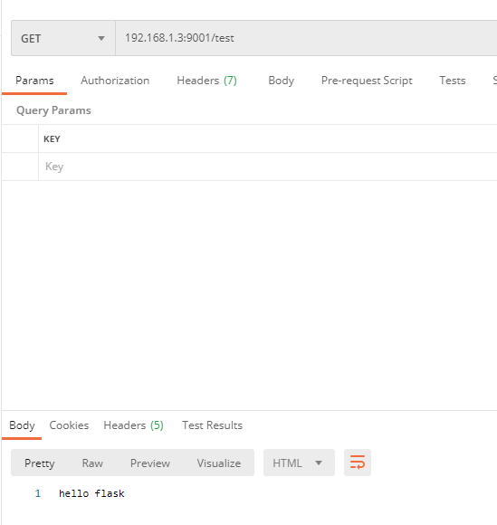
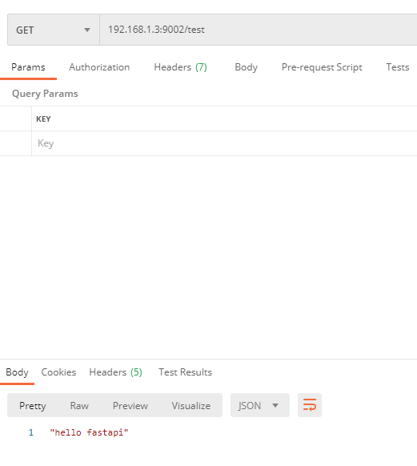

# python api 部署 demo

## flask docker部署

docker build -t  flask_image .

docker run -d -p 9001:80  flask_image

## fastapi docker部署

docker build -t  fastapi_image .

docker run -d -p 9002:80  fastapi_image

## api调用结果

flask api：

fastapi  api:

