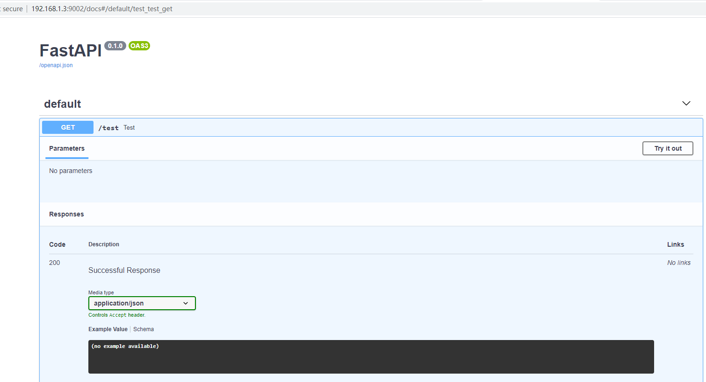

#### Uvicorn

Uvicorn is a lightning-fast "ASGI" server.

It runs asynchronous Python web code in a single process.

####  Gunicorn
You can use Gunicorn to manage Uvicorn and run multiple of these concurrent processes.

That way, you get the best of concurrency and parallelism.

####  FastAPI

FastAPI is a modern, fast (high-performance), web framework for building APIs with Python 3.6+.

The key features are:

Fast: Very high performance, on par with NodeJS and Go (thanks to Starlette and Pydantic).

Fast to code: Increase the speed to develop features by about 300% to 500% *.

Less bugs: Reduce about 40% of human (developer) induced errors. *

Intuitive: Great editor support. Completion everywhere. Less time debugging.

Easy: Designed to be easy to use and learn. Less time reading docs.

Short: Minimize code duplication. Multiple features from each parameter declaration. Less bugs.

Robust: Get production-ready code. With automatic interactive documentation.

Standards-based: Based on (and fully compatible with) the open standards for APIs: OpenAPI (previously known as Swagger) and JSON Schema.

* estimation based on tests on an internal development team, building production applications.

#### How to use

You don't need to clone the GitHub repo. You can use this image as a base image for other images, using this in your Dockerfile:

FROM tiangolo/uvicorn-gunicorn-fastapi:python3.7

COPY ./app /app

It will expect a file at /app/app/main.py.

Or otherwise a file at /app/main.py.

And will expect it to contain a variable app with your FastAPI application.

Then you can build your image from the directory that has your Dockerfile, e.g:

docker build -t myimage ./

####  Build your Image

Go to your project directory.

Create a Dockerfile with:

FROM tiangolo/uvicorn-gunicorn-fastapi:python3.7

COPY ./app /app

Create an app directory and enter in it.

Create a main.py file with:

from fastapi import FastAPI

app = FastAPI()

@app.get("/")

def read_root():

    return {"Hello": "World"}

@app.get("/items/{item_id}")

def read_item(item_id: int, q: str = None):

    return {"item_id": item_id, "q": q}
    
You should now have a directory structure like:

.
├── app
│   └── main.py
└── Dockerfile

Go to the project directory (in where your Dockerfile is, containing your app directory).

Build your FastAPI image:

docker build -t myimage .

Run a container based on your image:

docker run -d --name mycontainer -p 80:80 myimage

Now you have an optimized FastAPI server in a Docker container. Auto-tuned for your current server (and number of CPU cores).

####  Interactive API docs

####  WORKER_CLASS

The class to be used by Gunicorn for the workers.

By default, set to uvicorn.workers.UvicornWorker.

The fact that it uses Uvicorn is what allows using ASGI frameworks like FastAPI, and that is also what provides the maximum performance.

You probably shouldn't change it.

But if for some reason you need to use the alternative Uvicorn worker: uvicorn.workers.UvicornH11Worker you can set it with this environment variable.

You can set it like:

docker run -d -p 80:8080 -e WORKER_CLASS="uvicorn.workers.UvicornH11Worker" myimage

####  ACCESS_LOG

The access log file to write to.

By default "-", which means stdout (print in the Docker logs).

If you want to disable ACCESS_LOG, set it to an empty value.

For example, you could disable it with:

docker run -d -p 80:8080 -e ACCESS_LOG= myimage

####  ERROR_LOG

The error log file to write to.

By default "-", which means stderr (print in the Docker logs).

If you want to disable ERROR_LOG, set it to an empty value.

For example, you could disable it with:

docker run -d -p 80:8080 -e ERROR_LOG= myimage

